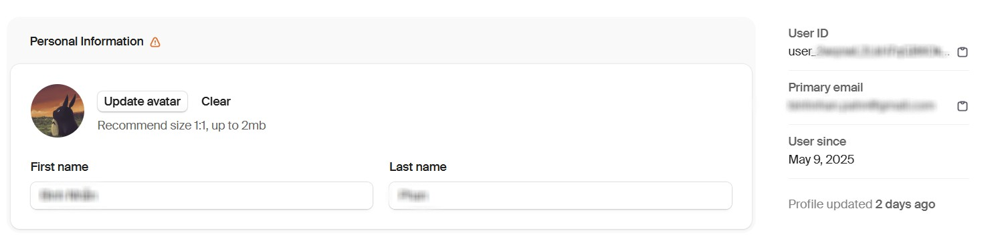

# ANIMENG
English learning website for kids, inspired by Duolingo

## Requirements: 
- [NodeJs](https://nodejs.org/en/download)
- Dependencies listed in package.json

```
git clone https://github.com/TTN-ATTN/animeng.git
npm install
```

### Authentication
Sign up [clerk](https://clerk.com/) account and get api key.

### Database
Sign up [neon](https://console.neon.tech/) account and get api key.

Then
```
npm run db:push
```
### Payment method
Signup [stripe](http://stripe.com/) account and get secret api key and then download stripe to your pc.
To get webhook secret key, please do following step by step.
``` 
    stripe login
    stripe listen --forward-to localhost:3000/api/webhooks/stripe
```

## Run locally:
Make sure that your current working directory is **animeng**
Run the following command:
```
npm run dev
stripe login
stripe listen --forward-to localhost:3000/api/webhooks/stripe
```
Access the website on your local machine: http://localhost:3000

## To access admin page

Get userID from clerk


=======

