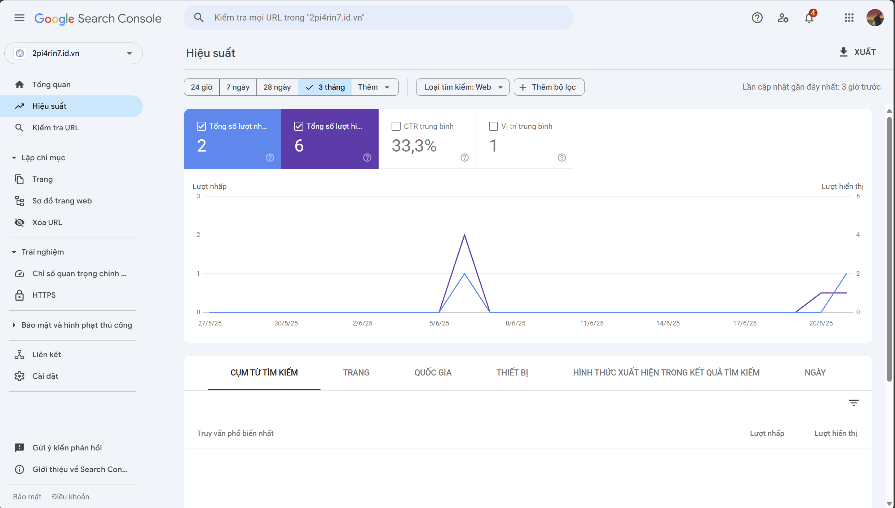
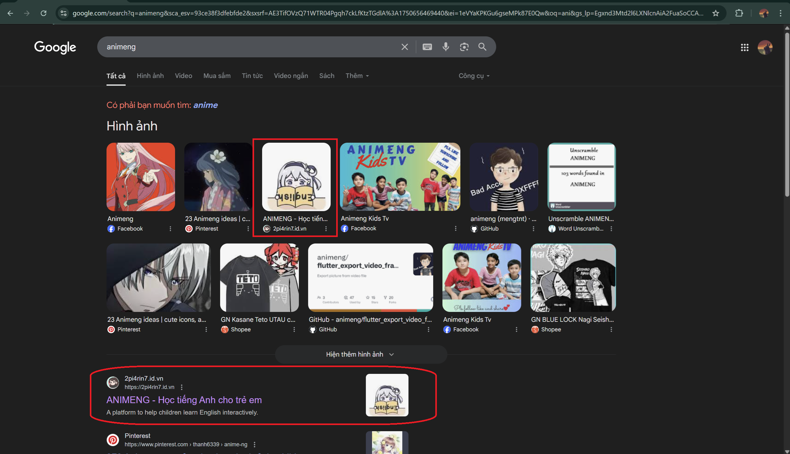
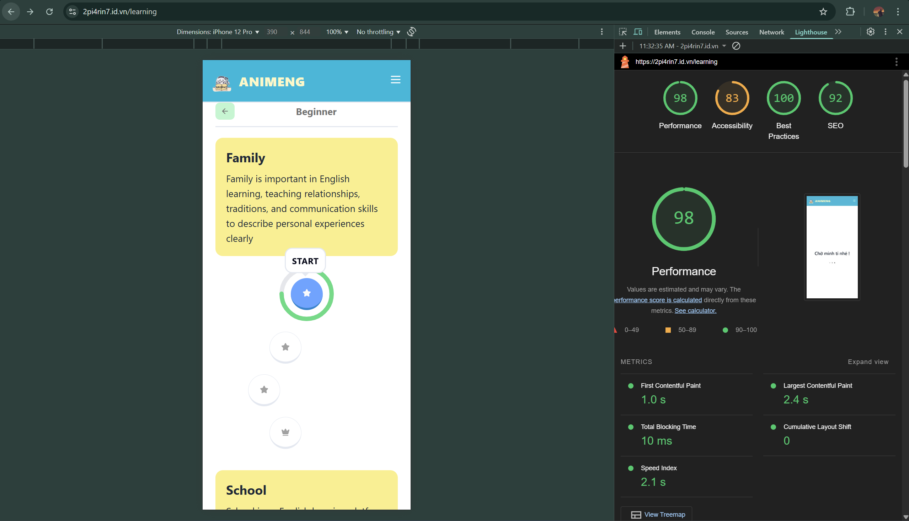
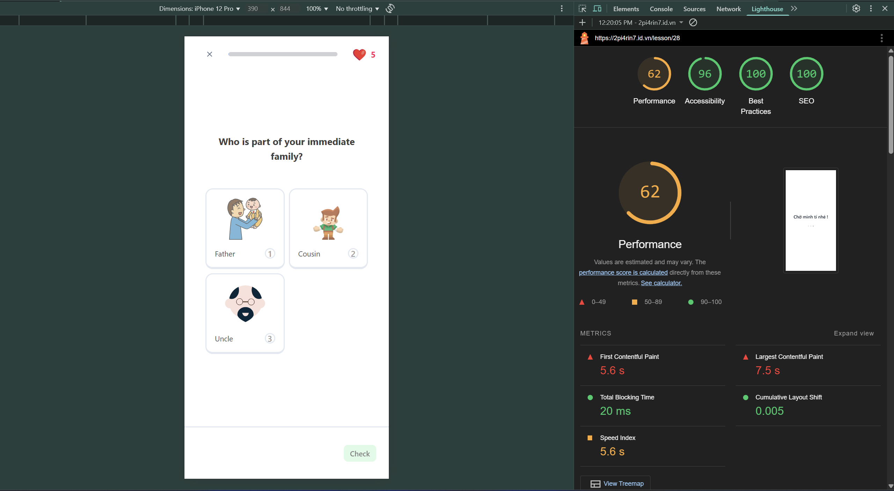
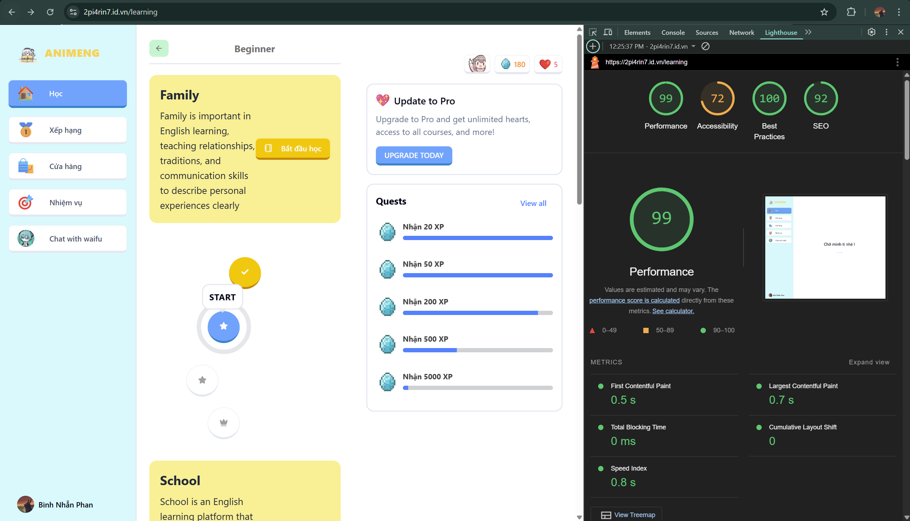
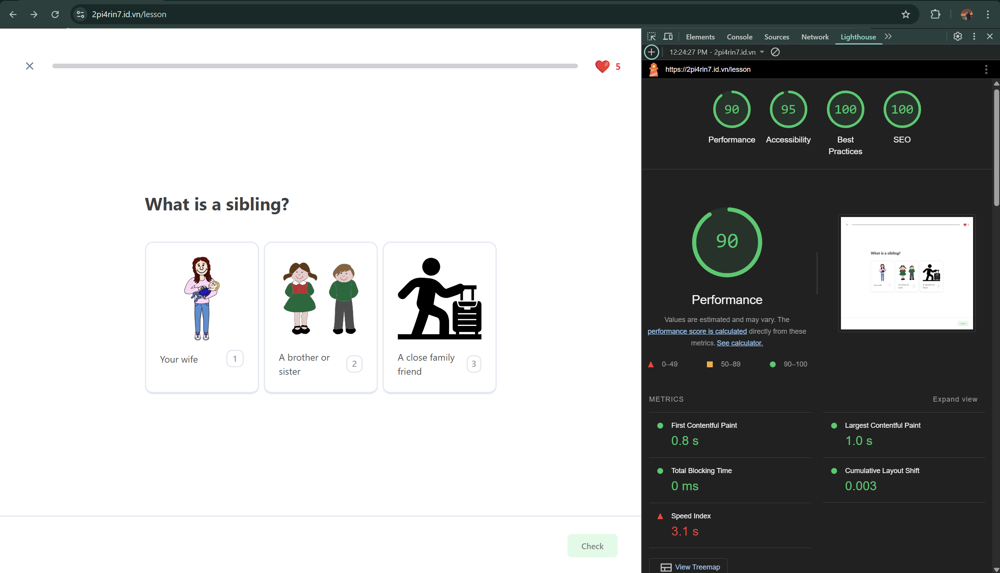
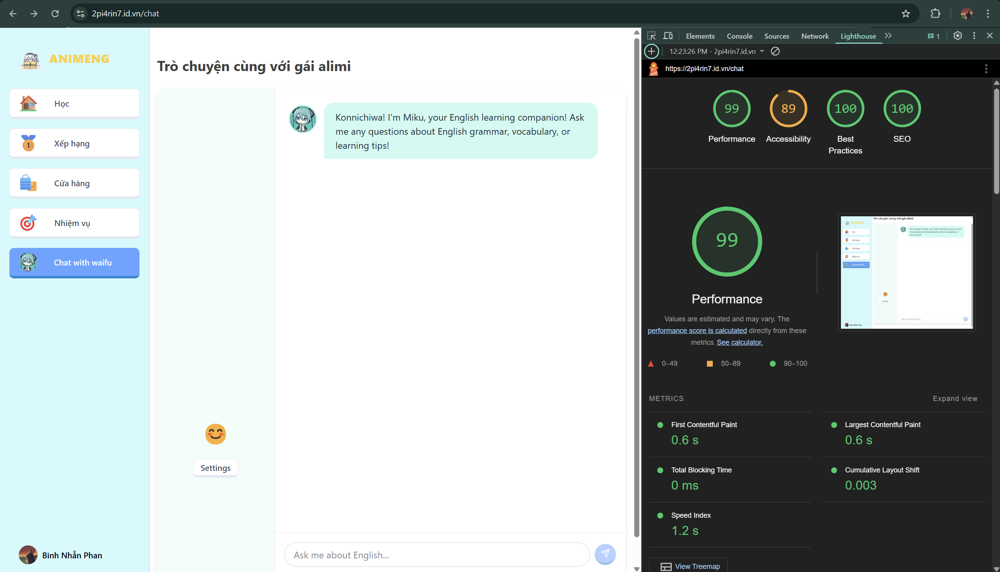
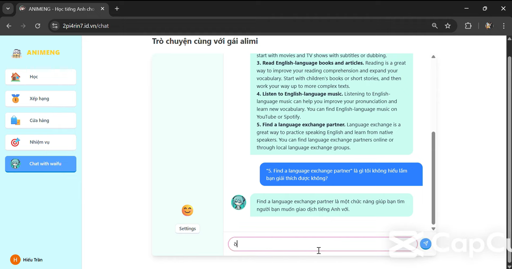
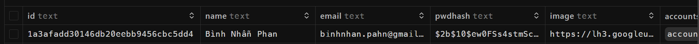

# 📚 Đồ án cuối kì môn Lập trình Web: ANIMENG

Chào mừng bạn đến với **ANIMENG** - một nền tảng học tiếng Anh trực tuyến dành cho trẻ em, lấy cảm hứng từ Duolingo! 🚀

Địa chỉ trang web: https://2pi4rin7.id.vn/

## 👥 Thành viên nhóm 8:

-   **23521087** - Phan Bình Nhẫn ([@2pi4rin7](https://github.com/2pi4rin7))
-   **23521090** - Trần Trung Nhân ([@TTN-ATTN](https://github.com/TTN-ATTN))
-   **23520492** - Trần Hiếu ([@anotherme13](https://github.com/anotherme13))

## 💡 Mô tả đồ án:

ANIMENG được xây dựng để cung cấp một môi trường học tiếng Anh vui vẻ và hiệu quả cho trẻ em, với các tính năng nổi bật:

### ✨ Tính năng cơ bản:

-   Hệ thống bài học tương tác.
-   Theo dõi tiến độ học tập.
-   Giao diện thân thiện với trẻ em.

### 🚀 Tính năng nâng cao:

-   **Chatbot hỗ trợ học tập:** Trợ lý ảo thông minh giúp giải đáp thắc mắc và tương tác với người học.
-   **Tích hợp thanh toán MoMo:** Hỗ trợ thanh toán tiện lợi cho các gói học cao cấp.
-   Load nội dung bài học không cần chuyển trang.

### 🛠️ Nền tảng sử dụng:

-   **Chatbot** `Flask` (Python) 🐍
-   **Frontend và Backend** `Next.js` (React/Next.js) 🌐
-   **Cơ sở dữ liệu:** `Neon` (PostgreSQL serverless) 🐘

### 📹 Video Demo trang web:

Link dẫn đến video demo trang web: [Link](https://youtu.be/VjY0lNApuj4)

### 🙌 Video TikTok:

Link dẫn đến video TikTok đánh giá mọi người về trang web: [Link](https://vt.tiktok.com/ZSkcorVPR/)

### 🔗 Link Drive

Link drive chứa source code có đầy đủ env và video demo: [Link](https://drive.google.com/drive/folders/1obb_AmApN4zJvD3EOpt-o4VInyAz3oIo?usp=sharing)

### Google Index 



### Kiểm tra tốc độ trang web

Tốc độ của phiên bản mobile:




Tốc độ của phiên bản desktop:






## ⚙️ Hướng dẫn cài đặt và chạy trên máy local:

### 📦 Cài đặt các thư viện yêu cầu:

Đảm bảo bạn đã cài đặt [Node.js](https://nodejs.org/en/download) (phiên bản khuyến nghị) trên máy tính của mình.

Sau đó, clone repository và cài đặt các dependencies:

```bash
git clone https://github.com/TTN-ATTN/animeng.git
cd animeng
npm install
```

### 🗄️ Cơ sở dữ liệu:

ANIMENG sử dụng cơ sở dữ liệu PostgreSQL serverless thông qua [Neon](https://neon.tech/).

1.  Đăng ký một tài khoản Neon.
2.  Tạo một project mới và lấy `DATABASE_URL`.
3.  Chạy lệnh sau để đẩy schema cơ sở dữ liệu lên Neon:

```bash
npm run db:push
```

### 🔑 Cài đặt các biến môi trường:

Tạo một file `.env` trong thư mục gốc của dự án và điền các biến môi trường cần thiết. Bạn có thể tham khảo file `.env.copy`.

```env
DATABASE_URL="" # URL kết nối đến cơ sở dữ liệu Neon của bạn

REDIRECT_URL=http://localhost:3000/home

MOMO_ACCESS_KEY="" # Khóa truy cập MoMo
MOMO_SECRET_KEY="" # Khóa bí mật MoMo

PUBLIC_URL="" # URL công khai của ứng dụng (ví dụ: http://localhost:3000)

AUTH_SECRET="" # Khóa bí mật cho xác thực (ví dụ: 123kasdl213lkjasdn1l23kj)
HUGGINGFACE_TOKEN="" # Token truy cập Hugging Face (cho chatbot)
GOOGLE_CLIENT_SECRET= # Client Secret từ Google Cloud Console
GOOGLE_CLIENT_ID= # Client ID từ Google Cloud Console

SMTP_HOST=smtp.gmail.com
SMTP_PORT=587
SMTP_USER="" # Địa chỉ email gửi SMTP
SMTP_PASS="" # Mật khẩu email hoặc mật khẩu ứng dụng SMTP
SMTP_FROM="" # Địa chỉ email gửi SMTP
NEXT_PUBLIC_BASE_URL=http://localhost:3000
```

### 🚀 Chạy ứng dụng ở local:

Đảm bảo bạn đang ở trong thư mục `animeng`.

Để chạy ứng dụng ở chế độ production:

```bash
npm run build
npm run start
```

Truy cập ứng dụng tại: [http://localhost:3000](http://localhost:3000)

Để chạy ứng dụng ở chế độ developer (có hot-reloading):

```bash
npm run dev
```

## 🤖 Thiết lập Chatbot cục bộ:

### 📝 Yêu cầu:

*   Python 3.9 trở lên
*   `pip`
*   `docker`
*   `docker-compose`

### ⬇️ Cài đặt:

```bash
pip install -r requirements.txt
```

### 🖥️ Chạy Chatbot Server:

```bash
python app/rag_utils.py [--rebuild]
python app/main.py
```

Kiểm tra trạng thái server bằng cách truy cập `http://localhost:8000/api/health`.

### 🌐 API Endpoint của Chatbot:

*   **POST** `/api/chat`
    *   **Request Body:**
        ```json
        {
          "message": "Câu hỏi của bạn ở đây"
        }
        ```
    *   **Response Body:**
        ```json
        {
          "response": "Câu trả lời đầy đủ của chatbot (hỗ trợ Markdown)",
          "mood": "trạng thái cảm xúc (ví dụ: default, happy)",
          "retrieved_context": [
            {"source": "đường dẫn file nguồn", "content_preview": "xem trước nội dung được truy xuất..."}
          ]
        }
        ```
*   **GET** `/api/health`: Kiểm tra trạng thái server, mô hình và RAG.

### 🐳 Cài đặt và Chạy Chatbot bằng Docker:

Đảm bảo bạn đã cài đặt [Docker Engine](https://docs.docker.com/engine/install/) và [Docker Compose](https://docs.docker.com/compose/install/).

1.  **Tạo file môi trường:** Trong thư mục gốc của dự án (cùng cấp với `docker-compose.yaml`), tạo một file tên là `chatbot.env`.
2.  **Thêm Hugging Face Token:** Thêm dòng sau vào file `chatbot.env`:

    ```env
    HUGGINGFACE_TOKEN=YOUR_TOKEN_HERE
    ```
    Thay `YOUR_TOKEN_HERE` bằng token Hugging Face thực tế của bạn. Bạn có thể tìm hiểu cách tạo token tại [đây](https://huggingface.co/docs/hub/en/security-tokens).

#### Build và Chạy Container:

1.  **Build Docker Image:** Chạy lệnh sau để build image dựa trên `Dockerfile`:
    ```bash
    docker-compose build
    ```
2.  **Chạy Container:** Chạy lệnh sau để khởi động container ở chế độ nền (detached mode):
    ```bash
    docker-compose up -d
    ```

## 🔒 Truy cập trang quản trị (Admin Page):

Để truy cập trang quản trị, bạn cần lấy `userID` từ trong database và thêm vào file `/lib/admin.ts`.

Ta vào quản trị database 
```
npm run db:studio
```

Hoặc có thể xem trong dashboard của Neon




