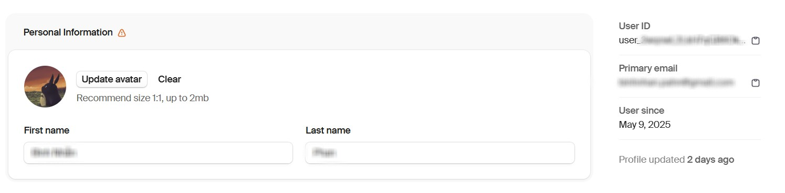

# Đồ án cuối kì môn lập trình web:
## Thành viên:
- 23521087 - Phan Bình Nhẫn - 2pi4rin7
- 23521090 - Trần Trung Nhân - TTN-ATTN
- 23520492 - Trần Hiếu - anotherme13

# ANIMENG
English learning website for kids, inspired by Duolingo

## Cài đặt các thư viện yêu cầu: 
- [NodeJs](https://nodejs.org/en/download)
- Các thư viện package cần cài đặt ở trong package.json

```
git clone https://github.com/TTN-ATTN/animeng.git
npm install
```
## Cơ sở dữ liệu
Đăng kí một tài khoản [Neon](https://neon.com/) để sử dụng database serverless postgres

Sau đó chạy command:
```
npm run db:push
```

## Cài đặt các biến môi trường:
```
DATABASE_URL="" # Neon API key

REDIRECT_URL=http://localhost:3000/home

MOMO_ACCESS_KEY="" # MoMo Access Key
MOMO_SECRET_KEY="" # MoMo Secret Key

PUBLIC_URL="" # Your Public URL

# PUBLIC_URL=http://localhost:3000
AUTH_SECRET="" # Your Auth Secret Key.
# Example: 123kasdl213lkjasdn1l23kj
HUGGINGFACE_TOKEN="" # Hugging Face Token
GOOGLE_CLIENT_SECRET= # Your client secret from Google Cloud Console
GOOGLE_CLIENT_ID= # Your client ID from Google Cloud Console

SMTP_HOST=smtp.gmail.com
SMTP_PORT=587
SMTP_USER="" # Your email address
SMTP_PASS="" # Your email password or app password
SMTP_FROM="" # Your email address
NEXT_PUBLIC_BASE_URL=http://localhost:3000
```

Sau khi thiết lập đầy đủ các biến môi trường, copy file **.env.copy** thành file **.env**

## Chạy ở local
Hãy đảm bảo rằng bạn đang chạy đúng thư mục **animeng**
sau đó sau các câu lệnh sau:
```
npm run build
npm run start
```
Truy cập vào trang web trên địa chỉ localhost của bạn http://localhost:3000

Hoặc chạy mới quyền developer:

```
npm run dev
```

## Set up chatbot locally
### 1. Yêu cầu

*   Python 3.9 trở lên
*   `pip` 
*   `docker`
*   `docker-compose`

### 2. Cài đặt

```bash
pip install -r requirements.txt
```


### 3. Chạy Chatbot Server

```
python app/rag_utils.py [--rebuild]
python app/main.py
```

Kiểm tra trạng thái server bằng cách truy cập `http://localhost:8000/api/health`.

### 4. API Endpoint

*   **POST** `/api/chat`
    *   **Request Body:**
        ```json
        {
          "message": "Câu hỏi của bạn ở đây",
        }
        ```
    *   **Response Body:**
        ```json
        {
          "response": "Câu trả lời đầy đủ của chatbot (hỗ trợ Markdown)",
          "mood": "trạng thái cảm xúc (ví dụ: default, happy)",
          "retrieved_context": [
            {"source": "đường dẫn file nguồn", "content_preview": "xem trước nội dung được truy xuất..."}
          ]
        }
        ```
*   **GET** `/api/health`: Kiểm tra trạng thái server, mô hình và RAG.


### 5. Cài đặt và Chạy bằng Docker

*   **Docker:** Cài đặt Docker Engine. ([Hướng dẫn cài đặt Docker](https://docs.docker.com/engine/install/))
*   **Docker Compose:** Cài đặt Docker Compose (thường đi kèm với Docker Desktop). ([Hướng dẫn cài đặt Docker Compose](https://docs.docker.com/compose/install/))


1.  **Tạo file môi trường:** Trong thư mục gốc của dự án (cùng cấp với `docker-compose.yaml`), tạo một file tên là `chatbot.env`
2.  **Thêm Hugging Face Token:** :
    ```env
    HUGGINGFACE_TOKEN=YOUR_TOKEN_HERE
    ```
    Thay `YOUR_TOKEN_HERE` bằng token Hugging Face thực tế của bạn. 
    
    [How to create huggingface token](https://huggingface.co/docs/hub/en/security-tokens)

#### Build và Chạy Container
1.  **Build Docker Image:** Chạy lệnh sau để build image dựa trên `Dockerfile`:
    ```bash
    docker-compose build
    ```
2.  **Chạy Container:** Chạy lệnh sau để khởi động container ở chế độ nền (detached mode):
    ```bash
    docker-compose up
    ```

## To access admin page

Get userID from clerk and add to /lib/admin.ts




